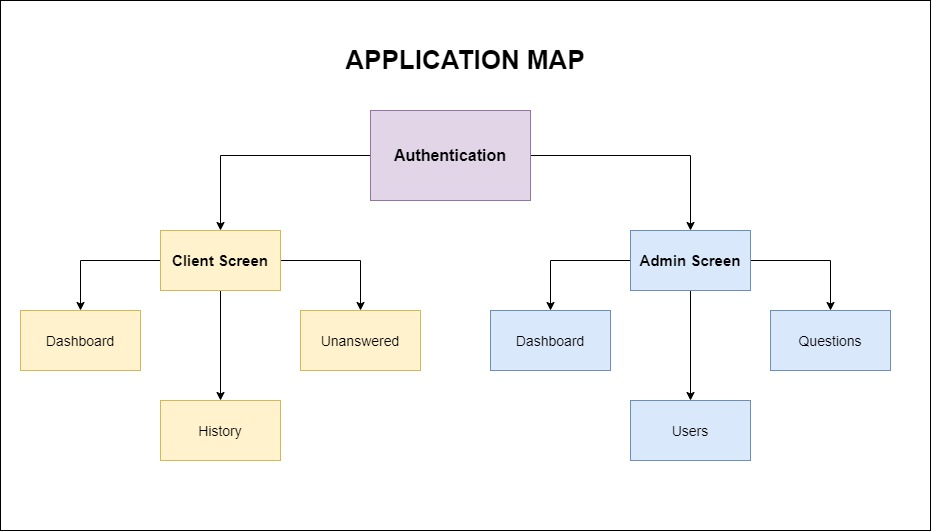

# Secret Source QuizApp

A simple app so users can play answering questions.

## Checklist

### CRUD for both USERS and QUESTIONS
- ⬜ Create Roles for "Admin" & "Player".
- ⬜ An admin can, create, edit, and delete questions and players.
- ⬜ An admin can, have access to a single panel page to manage questions.
- ⬜ A player can, see and answers questions, but can't access to the admin's panel.
- ⬜ A player can register and sign in.
- ⬜ Questions must have the question and at least one correct answer.
- ⬜ Should have status published/unpublished.
  
### Views

- ⬜ Register and login functionality - Only players can be registered.
- ⬜ Landing page with the "published" questions.
- ⬜ Admin panel to manage questions and players.

## Proposed technologies

- **For API**: In this project I am considering to use NestJS as the backend.
- **For ORM**: I am considering use TypeOrm because I understand its API very well but I am open to use any other.
- **For Client**: My confidence is Angular 10+.

## Application goal

We are going to build a web application which implements a basic Quiz App flow which allows you to learn german by answering questions. As a player you will be able to answer the quiz in just one opportunity, you will be promped when new question arise and it will store your score and history.

> If you want to see more details about my sketch please [read my notes](_notes/sketch.md)

## Tasks and estimation

|No.   |Environment   |Detail   |Time   |Status   |
|---|---|---|---|---|
|1   |server   |Generate the project scafolding with NestJS CLI   |5 min   |INCOMPLETE   |
|2   |server   |Create the folder architecture and basic configuration   |15 min   |INCOMPLETE   |
|3   |server   |Add Database MySQL configuration   |10 min   |INCOMPLETE   |
|4   |server   |Add authentication with JWT local and strategy  |1 hour   |INCOMPLETE   |
|5   |server   |Add CRUD for Questions  |1 hour   |INCOMPLETE   |
|6   |server   |Add Quiz Service / Controller  |1 hour   |INCOMPLETE   |

## API Endpoints

Please checkout the document for API Endpoints planning, [clicking here](_notes/apiMap.md).

## License

This project is based on the MIT license

## Author
- Ruslan Gonzalez
- Twitter: [https://twitter.com/ruslangonzalez](@ruslangonzalez)
