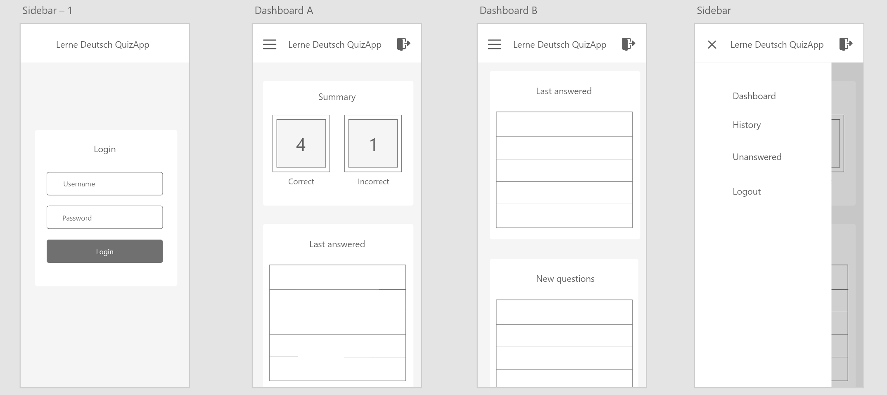
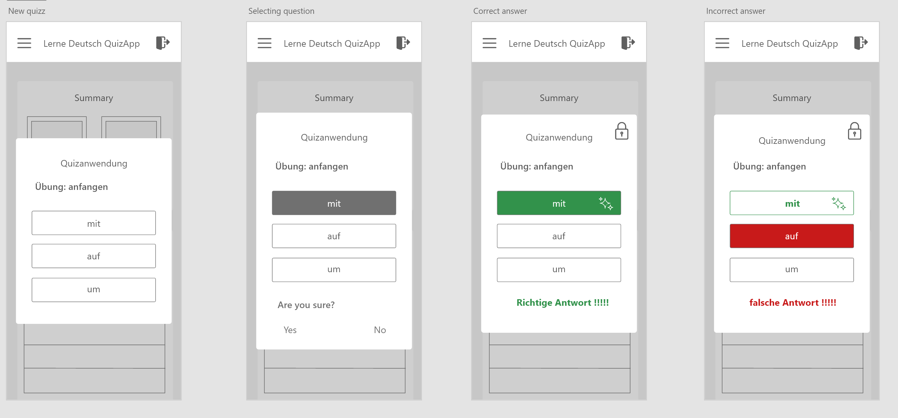
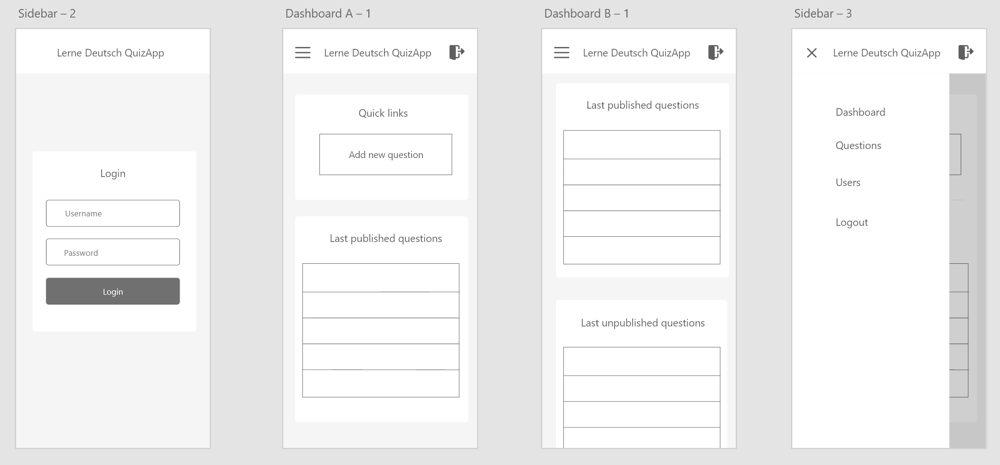
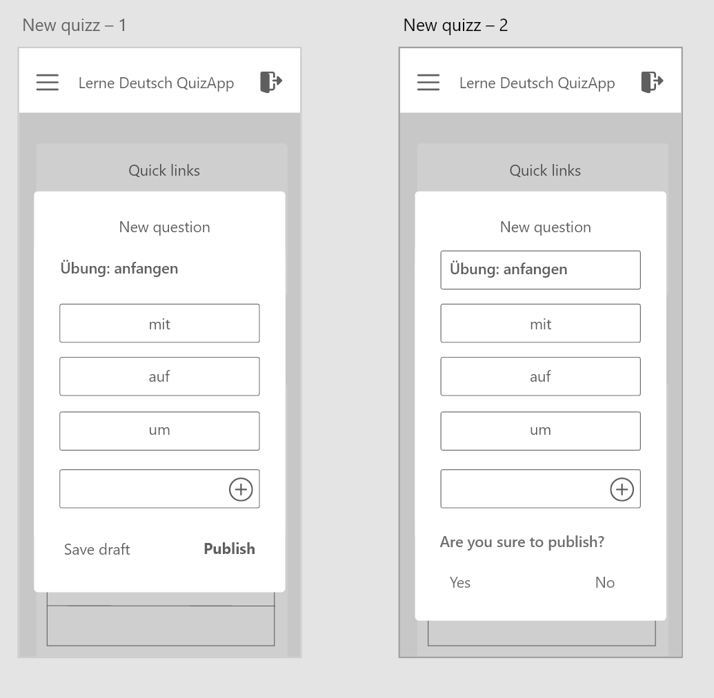

# Sketch and prototype

[Go back to table of contents](README.md)

This sketch is based on the idea of the QuizApp:

We are going to build an application which uses a QuizApp API in its core,the frontend will be used by Admins and Players, the idea is to have mobile first application which reuses its layout for both screens.

With this application we will learn German by answering the questions of the game. You will only be able to answer once but you will be able to evaluate your correct answer. All possible levels and administrators can add as many questions as they want.

## Application map

This is how the application will look broadly:

## Client screen

> This is when a player is login

There is a Dashboard which shows the correct and incorrect answers.

The dashboard will show also the last answered and new questions — of course, when they exist — as a preview, but they will be all together in the history section.

The sidebar will show by capturing the click event in the top left menu icon.

Players will have just one opportunity to answer then the response will be saved for review.

## Admin screen

For accessing the admin panel, it's going to be required to be an user with admin roles, and will be accessible using the same LOGIN, however it's very important to understand only players are able to play, and only admins can add questions.

> Admin Dashboard 
In the admin you will have the opportunity to add new question and see last questions published and unpublished.

> Adding a question

In case you don't want to just publish the question you could just save draft and this will be stored for review prior to publish.

## Final words.

This is the set of my ideas about this app, this is in evaluating process. 